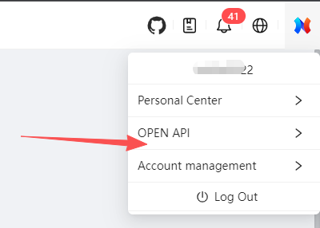

# NEWPOS STORE Open SDK（Java）

## 1. Overview

The NEWPOS STORE Open SDK (Java) is designed to help third-party systems quickly and securely integrate with the **NEWPOS STORE Platform**, providing standardized APIs to access terminal and application-related data.

The SDK encapsulates API invocation, authentication, request parameter handling, and response parsing, allowing developers to focus on business logic without dealing with underlying communication or security details.

## 2. SDK Capabilities

The current SDK provides the following features:

- Terminal basic information query
- Installed application list query for terminals
- Unified pagination response structure
- API Key / API Secret authentication mechanism
- Unified response object model

##  3. Runtime Requirements

- **JDK 11 or above**
- Maven or Gradle build tool
- Network access to the NEWPOS STORE service endpoint


## 4. Integration Process

整体接入流程如下：

1. The overall integration process is as follows:

   **https://www.newposstore.com/**

   After registering on the NEWPOS STORE Cloud Platform, apply for Developer & Device Management permissions to enable Open API access.**

   

   

   

2. Obtain the assigned `API Key` and `API Secret`

3. Import the Open SDK

4. Initialize the SDK client

5. Invoke the corresponding APIs based on business requirements

## 5. SDK Initialization

Before initializing the SDK client, please ensure that the SDK JAR has been properly installed into your local Maven repository.

### 5.1 Install SDK JAR into Local Maven Repository

If the SDK is provided as a standalone JAR file (not published to a public Maven repository), you need to install it into your local Maven repository manually.

#### Step 1: Prepare the SDK JAR

Ensure you have received the SDK JAR file from NEWPOS STORE, for example:

```
newstore-openapi-sdk-1.0.0.jar
```

#### Step 2: Install the JAR Using Maven Command

Execute the following command in the directory where the JAR file is located:

```

mvn install:install-file -Dfile=newstore-openapi-sdk-1.0.0.jar -DgroupId=com.newposstore.api -DartifactId=newstore-openapi-sdk -Dversion=1.0.0 -Dpackaging=jar
```

After successful execution, the SDK will be installed into your local Maven repository.

------

### 5.2 Add SDK Dependency

Add the following dependency to your project’s `pom.xml`:

```java
<dependency>
    <groupId>com.newposstore.api</groupId>
    <artifactId>newstore-openapi-sdk</artifactId>
    <version>1.0.1</version>
</dependency>
```

### 5.3 Create API Client

```java

TermApi termApi = new TermApi(
    serverUrl,
    apiKey,
    apiSecret
);
```

### Parameter Description

| Parameter | Description                         |
| --------- | ----------------------------------- |
| serverUrl | NEWPOS STORE service endpoint       |
| apiKey    | API Key assigned by the platform    |
| apiSecret | API Secret assigned by the platform |

⚠️ Please keep your API Secret secure and do not disclose it to third parties.

## 6. API Usage Examples

### 6.1 Query Installed Applications on a Terminal

This API is used to retrieve a paginated list of applications currently installed on a specified terminal.

#### Example Code

```java

TermInstallAppListReq req = new TermInstallAppListReq();
req.setSn("921000010191");
req.setPageNum(1);
req.setPageSize(10);

TableDataInfo<TermAppInfResp> result = termApi.installedAppListCall(req);
```

#### Request Parameters

| Parameter | Type    | Required | Description              |
| --------- | ------- | -------- | ------------------------ |
| sn        | String  | Yes      | Terminal SN              |
| pageNum   | Integer | No       | Page number (default: 1) |
| pageSize  | Integer | No       | Page size                |

#### Response Description

The response is returned in a paginated data structure:

```java
TableDataInfo<T>
```

It contains the total record count and the data list for the current page.

------

### 6.2 Query Terminal Details

This API is used to retrieve basic information of a specified terminal.

#### Example Code

```java

TermDetailReq req = new TermDetailReq();
req.setSn("921000010191");

R<TerminalDetailResp> resp = termApi.termDetailCall(req);
```

#### Response Structure

Most APIs return a unified response structure:

```java
R<T>
```


## 7. Notes

- Ensure that the correct service endpoint is used (test environment vs. production environment)
- It is recommended to handle API exceptions in a unified manner
- For paginated APIs, please use a reasonable `pageSize` to avoid excessive data retrieval


## 8. Version History

### v1.0.0

- Initial release
- Supports terminal information and installed application list queries

## 9. Technical Support

If you encounter any issues during integration, please contact the NEWPOS STORE technical support team for assistance.

